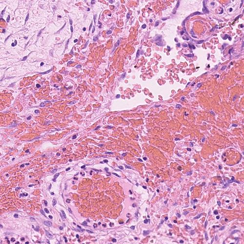

# Efficient Vision Transformer Experiments in Computational Pathology

This repository contains the implementations of some experiments with efficient vision transformers for compuational pathology tasks. 

Recently, vision transformers have shown themselves to be the state-of-the-art on many computer vision tasks such as ImageNet and attempts have been made to address the large data requirements of the Transformer architecture [[1]](#1) [[2]](#2). Additionally, many so called "efficient transformer" alternative architectures have been proposed to address the quadratic memory requirement of the self-attention matrix in the traditional transformer.

A recent benchmark examined 10 of these architectures in a variety of long range tasks; however, the image tasks were only grayscale and focussed on images of maximum size 128x128 pixels [[3]](#3). In this repo we plan to test some of the better performing architectures on computational pathology tasks starting with the Performer [[4]](#4).

## CRCHistoPhenotypes dataset

Our first experiments are using a dataset of 100 H&E stained colorectal adenocarcinomas, each of size 500x500x3 [[5]](#5). We have converted this into a binary classification task to determine whether the image does or does not contain epithelial cells. An example image from the dataset is shown below.

## References
<a id="1">[1]</a> Dosovitskiy, A., Lucas Beyer, Alexander Kolesnikov, Dirk Weissenborn, Xiaohua Zhai, Thomas Unterthiner, M. Dehghani, Matthias Minderer, Georg Heigold, S. Gelly, Jakob Uszkoreit and N. Houlsby. “An Image is Worth 16x16 Words: Transformers for Image Recognition at Scale.” ArXiv abs/2010.11929 (2020)

<a id="2">[2]</a> Touvron, Hugo, M. Cord, M. Douze, F. Massa, Alexandre Sablayrolles and H. Jégou. “Training data-efficient image transformers & distillation through attention.” ArXiv abs/2012.12877 (2020)

<a id="3">[3]</a> Tay, Yi, M. Dehghani, Samira Abnar, Y. Shen, Dara Bahri, Philip Pham, J. Rao, Liu Yang, Sebastian Ruder and Donald Metzler. “Long Range Arena: A Benchmark for Efficient Transformers.” ArXiv abs/2011.04006 (2020)

<a id="4">[4]</a> Choromanski, Krzysztof, Valerii Likhosherstov, David Dohan, Xingyou Song, A. Gane, Tamás Sarlós, P. Hawkins, J. Davis, Afroz Mohiuddin, L. Kaiser, D. Belanger, Lucy J. Colwell and Adrian Weller. “Rethinking Attention with Performers.” ArXiv abs/2009.14794 (2020)

<a id="5">[5]</a> Sirinukunwattana, K., S. Raza, Y. Tsang, D. Snead, I. Cree and N. Rajpoot. “Locality Sensitive Deep Learning for Detection and Classification of Nuclei in Routine Colon Cancer Histology Images.” IEEE transactions on medical imaging 35 5 (2016): 1196-1206 .

Credit to lucidrains for his implementation of the Performer which has been used in this repository https://github.com/lucidrains/performer-pytorch .